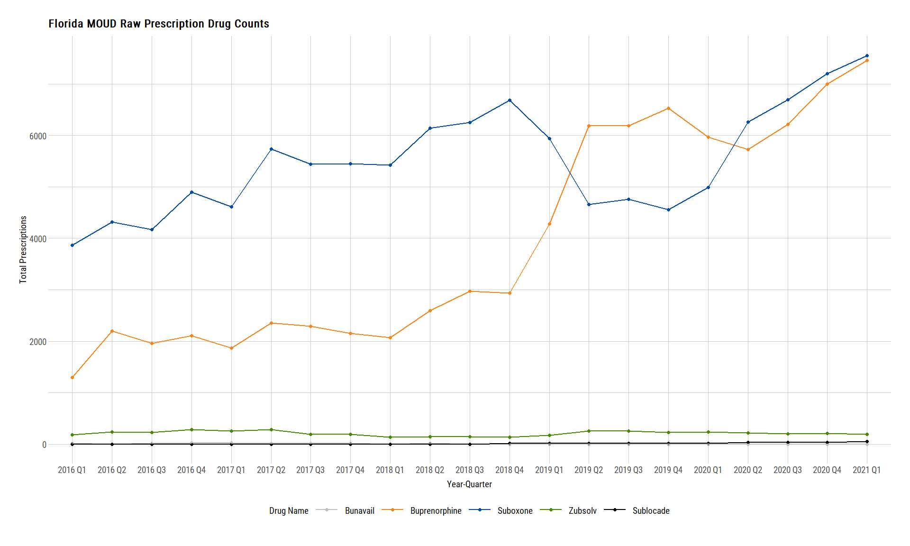
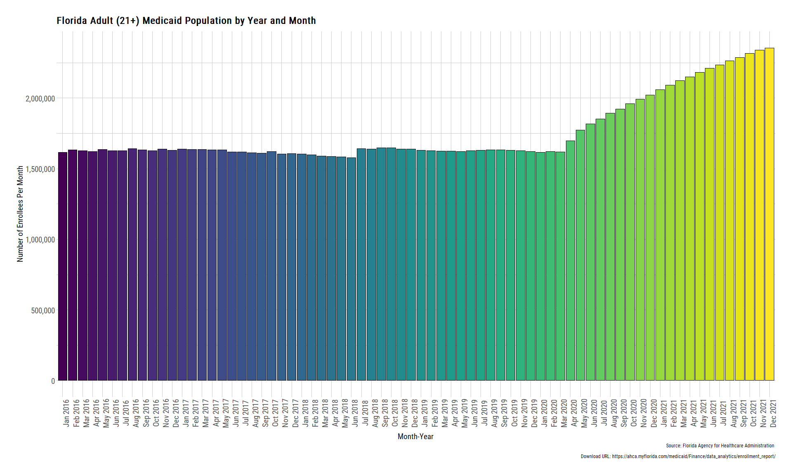
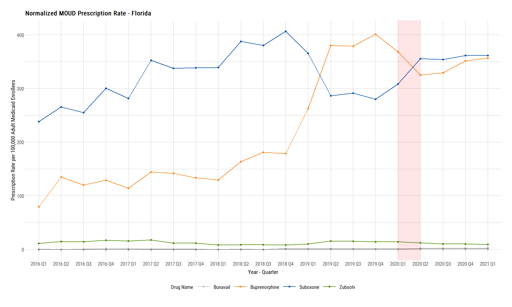

MOUD in Florida Medicaid Population
================
Michael Q. Maguire, MS
February 18th, 2022

## Packages Used

``` r
library(tidyverse)
library(data.table)
library(rvest)
library(hrbrthemes)
```

## Read in the SDUD data set

``` r
sdud <- fread(
  file_location,
  colClasses = c('proper_ndc' = 'character')
)
```

## Subset to Florida Only and Create MOUD Flags

Variable `moudFlag` represents whether the brand name has a pattern
match with the below values. Variable `medication` represents the
categorization according to AG.

``` r
sdudFL <- sdud[
  i = (state == 'FL' & data.table::between(year, 2016, 2021)),
  j = .(utilization.type, state, year, quarter, suppression, gennme, prodnme, numberrx)
][
  , 
  `:=` (moudFlag = ifelse(grepl(x = prodnme, pattern = "bupreno|suboxone|zubsolv|cassipa|bunavail|subutex", ignore.case = TRUE) == TRUE, 1, 0),
        medication = case_when(
          grepl(x = prodnme, pattern = 'bunavail', ignore.case = TRUE) == TRUE ~ "Bunavail",
          grepl(x = prodnme, pattern = 'subutex', ignore.case = TRUE) == TRUE ~ 'Subutex',
          grepl(x = prodnme, pattern = 'suboxone', ignore.case = TRUE) == TRUE ~ 'Suboxone',
          grepl(x = prodnme, pattern = 'cassipa', ignore.case = TRUE) == TRUE ~ 'Cassipa',
          grepl(x = prodnme, pattern = 'zubsolv', ignore.case = TRUE) == TRUE ~ 'Zubsolv',
          grepl(x = prodnme, pattern = 'buprenorphine', ignore.case = TRUE) == TRUE ~ 'Buprenorphine',
          TRUE ~ 'Not an OUD Drug'
          ),
        yearQuarter = zoo::as.yearqtr(format(paste0(year, quarter)), "%Y%q")
        )
]

setorder(sdudFL, state, yearQuarter, gennme, prodnme, suppression)

sdudFL |> janitor::tabyl(moudFlag)
```

    ##  moudFlag      n     percent
    ##         0 643226 0.998226172
    ##         1   1143 0.001773828

``` r
sdudFL |> janitor::tabyl(medication)
```

    ##       medication      n      percent
    ##         Bunavail     26 4.034955e-05
    ##    Buprenorphine    826 1.281874e-03
    ##  Not an OUD Drug 643226 9.982262e-01
    ##         Suboxone    162 2.514087e-04
    ##          Zubsolv    129 2.001959e-04

``` r
sdudFL |> janitor::tabyl(medication, moudFlag)
```

    ##       medication      0   1
    ##         Bunavail      0  26
    ##    Buprenorphine      0 826
    ##  Not an OUD Drug 643226   0
    ##         Suboxone      0 162
    ##          Zubsolv      0 129

## Subset to only OUD medications and aggregate.

``` r
sdudFLAggregate <- sdudFL[
  i = moudFlag == 1 & suppression == 'F',
  j = .(totalRX = sum(numberrx)),
  by = .(yearQuarter, medication)
]

setorder(sdudFLAggregate, medication, yearQuarter)

sdudFLAggregate
```

    ##     yearQuarter    medication totalRX
    ##  1:     2016 Q1      Bunavail      15
    ##  2:     2016 Q3      Bunavail      16
    ##  3:     2016 Q4      Bunavail      29
    ##  4:     2017 Q1      Bunavail      30
    ##  5:     2017 Q2      Bunavail      19
    ##  6:     2017 Q3      Bunavail      13
    ##  7:     2017 Q4      Bunavail      17
    ##  8:     2018 Q2      Bunavail      14
    ##  9:     2016 Q1 Buprenorphine    1294
    ## 10:     2016 Q2 Buprenorphine    2198
    ## 11:     2016 Q3 Buprenorphine    1961
    ## 12:     2016 Q4 Buprenorphine    2106
    ## 13:     2017 Q1 Buprenorphine    1868
    ## 14:     2017 Q2 Buprenorphine    2354
    ## 15:     2017 Q3 Buprenorphine    2287
    ## 16:     2017 Q4 Buprenorphine    2153
    ## 17:     2018 Q1 Buprenorphine    2067
    ## 18:     2018 Q2 Buprenorphine    2594
    ## 19:     2018 Q3 Buprenorphine    2974
    ## 20:     2018 Q4 Buprenorphine    2938
    ## 21:     2019 Q1 Buprenorphine    4277
    ## 22:     2019 Q2 Buprenorphine    6185
    ## 23:     2019 Q3 Buprenorphine    6187
    ## 24:     2019 Q4 Buprenorphine    6530
    ## 25:     2020 Q1 Buprenorphine    5963
    ## 26:     2020 Q2 Buprenorphine    5727
    ## 27:     2020 Q3 Buprenorphine    6212
    ## 28:     2020 Q4 Buprenorphine    7000
    ## 29:     2021 Q1 Buprenorphine    7455
    ## 30:     2016 Q1      Suboxone    3870
    ## 31:     2016 Q2      Suboxone    4322
    ## 32:     2016 Q3      Suboxone    4173
    ## 33:     2016 Q4      Suboxone    4902
    ## 34:     2017 Q1      Suboxone    4609
    ## 35:     2017 Q2      Suboxone    5738
    ## 36:     2017 Q3      Suboxone    5443
    ## 37:     2017 Q4      Suboxone    5451
    ## 38:     2018 Q1      Suboxone    5419
    ## 39:     2018 Q2      Suboxone    6138
    ## 40:     2018 Q3      Suboxone    6250
    ## 41:     2018 Q4      Suboxone    6681
    ## 42:     2019 Q1      Suboxone    5942
    ## 43:     2019 Q2      Suboxone    4654
    ## 44:     2019 Q3      Suboxone    4759
    ## 45:     2019 Q4      Suboxone    4555
    ## 46:     2020 Q1      Suboxone    4990
    ## 47:     2020 Q2      Suboxone    6265
    ## 48:     2020 Q3      Suboxone    6690
    ## 49:     2020 Q4      Suboxone    7200
    ## 50:     2021 Q1      Suboxone    7553
    ## 51:     2016 Q1       Zubsolv     185
    ## 52:     2016 Q2       Zubsolv     240
    ## 53:     2016 Q3       Zubsolv     233
    ## 54:     2016 Q4       Zubsolv     281
    ## 55:     2017 Q1       Zubsolv     257
    ## 56:     2017 Q2       Zubsolv     288
    ## 57:     2017 Q3       Zubsolv     191
    ## 58:     2017 Q4       Zubsolv     191
    ## 59:     2018 Q1       Zubsolv     133
    ## 60:     2018 Q2       Zubsolv     143
    ## 61:     2018 Q3       Zubsolv     142
    ## 62:     2018 Q4       Zubsolv     137
    ## 63:     2019 Q1       Zubsolv     172
    ## 64:     2019 Q2       Zubsolv     260
    ## 65:     2019 Q3       Zubsolv     254
    ## 66:     2019 Q4       Zubsolv     232
    ## 67:     2020 Q1       Zubsolv     236
    ## 68:     2020 Q2       Zubsolv     216
    ## 69:     2020 Q3       Zubsolv     197
    ## 70:     2020 Q4       Zubsolv     208
    ## 71:     2021 Q1       Zubsolv     193
    ##     yearQuarter    medication totalRX

## Create table containing all years, quarters, and drugs.

``` r
yearQuarter <- unique(sdudFL$yearQuarter, by = yearQuarter)

allDrugs <- unique(sdudFLAggregate$medication, by = medication)

cartesianYearQuarterDrug <- CJ(yearQuarter, allDrugs)

cartesianYearQuarterDrug
```

    ##     yearQuarter      allDrugs
    ##  1:     2016 Q1      Bunavail
    ##  2:     2016 Q1 Buprenorphine
    ##  3:     2016 Q1      Suboxone
    ##  4:     2016 Q1       Zubsolv
    ##  5:     2016 Q2      Bunavail
    ##  6:     2016 Q2 Buprenorphine
    ##  7:     2016 Q2      Suboxone
    ##  8:     2016 Q2       Zubsolv
    ##  9:     2016 Q3      Bunavail
    ## 10:     2016 Q3 Buprenorphine
    ## 11:     2016 Q3      Suboxone
    ## 12:     2016 Q3       Zubsolv
    ## 13:     2016 Q4      Bunavail
    ## 14:     2016 Q4 Buprenorphine
    ## 15:     2016 Q4      Suboxone
    ## 16:     2016 Q4       Zubsolv
    ## 17:     2017 Q1      Bunavail
    ## 18:     2017 Q1 Buprenorphine
    ## 19:     2017 Q1      Suboxone
    ## 20:     2017 Q1       Zubsolv
    ## 21:     2017 Q2      Bunavail
    ## 22:     2017 Q2 Buprenorphine
    ## 23:     2017 Q2      Suboxone
    ## 24:     2017 Q2       Zubsolv
    ## 25:     2017 Q3      Bunavail
    ## 26:     2017 Q3 Buprenorphine
    ## 27:     2017 Q3      Suboxone
    ## 28:     2017 Q3       Zubsolv
    ## 29:     2017 Q4      Bunavail
    ## 30:     2017 Q4 Buprenorphine
    ## 31:     2017 Q4      Suboxone
    ## 32:     2017 Q4       Zubsolv
    ## 33:     2018 Q1      Bunavail
    ## 34:     2018 Q1 Buprenorphine
    ## 35:     2018 Q1      Suboxone
    ## 36:     2018 Q1       Zubsolv
    ## 37:     2018 Q2      Bunavail
    ## 38:     2018 Q2 Buprenorphine
    ## 39:     2018 Q2      Suboxone
    ## 40:     2018 Q2       Zubsolv
    ## 41:     2018 Q3      Bunavail
    ## 42:     2018 Q3 Buprenorphine
    ## 43:     2018 Q3      Suboxone
    ## 44:     2018 Q3       Zubsolv
    ## 45:     2018 Q4      Bunavail
    ## 46:     2018 Q4 Buprenorphine
    ## 47:     2018 Q4      Suboxone
    ## 48:     2018 Q4       Zubsolv
    ## 49:     2019 Q1      Bunavail
    ## 50:     2019 Q1 Buprenorphine
    ## 51:     2019 Q1      Suboxone
    ## 52:     2019 Q1       Zubsolv
    ## 53:     2019 Q2      Bunavail
    ## 54:     2019 Q2 Buprenorphine
    ## 55:     2019 Q2      Suboxone
    ## 56:     2019 Q2       Zubsolv
    ## 57:     2019 Q3      Bunavail
    ## 58:     2019 Q3 Buprenorphine
    ## 59:     2019 Q3      Suboxone
    ## 60:     2019 Q3       Zubsolv
    ## 61:     2019 Q4      Bunavail
    ## 62:     2019 Q4 Buprenorphine
    ## 63:     2019 Q4      Suboxone
    ## 64:     2019 Q4       Zubsolv
    ## 65:     2020 Q1      Bunavail
    ## 66:     2020 Q1 Buprenorphine
    ## 67:     2020 Q1      Suboxone
    ## 68:     2020 Q1       Zubsolv
    ## 69:     2020 Q2      Bunavail
    ## 70:     2020 Q2 Buprenorphine
    ## 71:     2020 Q2      Suboxone
    ## 72:     2020 Q2       Zubsolv
    ## 73:     2020 Q3      Bunavail
    ## 74:     2020 Q3 Buprenorphine
    ## 75:     2020 Q3      Suboxone
    ## 76:     2020 Q3       Zubsolv
    ## 77:     2020 Q4      Bunavail
    ## 78:     2020 Q4 Buprenorphine
    ## 79:     2020 Q4      Suboxone
    ## 80:     2020 Q4       Zubsolv
    ## 81:     2021 Q1      Bunavail
    ## 82:     2021 Q1 Buprenorphine
    ## 83:     2021 Q1      Suboxone
    ## 84:     2021 Q1       Zubsolv
    ##     yearQuarter      allDrugs

## Full Join with the above table with the `sdudFLAggregate` to get values that don’t exist for a given yearQuarter.

``` r
yearQuarterAllFLAggregate <- merge.data.table(
  cartesianYearQuarterDrug,
  sdudFLAggregate,
  by.x = c('yearQuarter', 'allDrugs'),
  by.y = c('yearQuarter', 'medication'),
  all.x = TRUE
)

sum(is.na(yearQuarterAllFLAggregate$totalRX))
```

    ## [1] 13

``` r
yearQuarterAllFLAggregate[is.na(totalRX), totalRX := 0]

yearQuarterAllFLAggregate
```

    ##     yearQuarter      allDrugs totalRX
    ##  1:     2016 Q1      Bunavail      15
    ##  2:     2016 Q1 Buprenorphine    1294
    ##  3:     2016 Q1      Suboxone    3870
    ##  4:     2016 Q1       Zubsolv     185
    ##  5:     2016 Q2      Bunavail       0
    ##  6:     2016 Q2 Buprenorphine    2198
    ##  7:     2016 Q2      Suboxone    4322
    ##  8:     2016 Q2       Zubsolv     240
    ##  9:     2016 Q3      Bunavail      16
    ## 10:     2016 Q3 Buprenorphine    1961
    ## 11:     2016 Q3      Suboxone    4173
    ## 12:     2016 Q3       Zubsolv     233
    ## 13:     2016 Q4      Bunavail      29
    ## 14:     2016 Q4 Buprenorphine    2106
    ## 15:     2016 Q4      Suboxone    4902
    ## 16:     2016 Q4       Zubsolv     281
    ## 17:     2017 Q1      Bunavail      30
    ## 18:     2017 Q1 Buprenorphine    1868
    ## 19:     2017 Q1      Suboxone    4609
    ## 20:     2017 Q1       Zubsolv     257
    ## 21:     2017 Q2      Bunavail      19
    ## 22:     2017 Q2 Buprenorphine    2354
    ## 23:     2017 Q2      Suboxone    5738
    ## 24:     2017 Q2       Zubsolv     288
    ## 25:     2017 Q3      Bunavail      13
    ## 26:     2017 Q3 Buprenorphine    2287
    ## 27:     2017 Q3      Suboxone    5443
    ## 28:     2017 Q3       Zubsolv     191
    ## 29:     2017 Q4      Bunavail      17
    ## 30:     2017 Q4 Buprenorphine    2153
    ## 31:     2017 Q4      Suboxone    5451
    ## 32:     2017 Q4       Zubsolv     191
    ## 33:     2018 Q1      Bunavail       0
    ## 34:     2018 Q1 Buprenorphine    2067
    ## 35:     2018 Q1      Suboxone    5419
    ## 36:     2018 Q1       Zubsolv     133
    ## 37:     2018 Q2      Bunavail      14
    ## 38:     2018 Q2 Buprenorphine    2594
    ## 39:     2018 Q2      Suboxone    6138
    ## 40:     2018 Q2       Zubsolv     143
    ## 41:     2018 Q3      Bunavail       0
    ## 42:     2018 Q3 Buprenorphine    2974
    ## 43:     2018 Q3      Suboxone    6250
    ## 44:     2018 Q3       Zubsolv     142
    ## 45:     2018 Q4      Bunavail       0
    ## 46:     2018 Q4 Buprenorphine    2938
    ## 47:     2018 Q4      Suboxone    6681
    ## 48:     2018 Q4       Zubsolv     137
    ## 49:     2019 Q1      Bunavail       0
    ## 50:     2019 Q1 Buprenorphine    4277
    ## 51:     2019 Q1      Suboxone    5942
    ## 52:     2019 Q1       Zubsolv     172
    ## 53:     2019 Q2      Bunavail       0
    ## 54:     2019 Q2 Buprenorphine    6185
    ## 55:     2019 Q2      Suboxone    4654
    ## 56:     2019 Q2       Zubsolv     260
    ## 57:     2019 Q3      Bunavail       0
    ## 58:     2019 Q3 Buprenorphine    6187
    ## 59:     2019 Q3      Suboxone    4759
    ## 60:     2019 Q3       Zubsolv     254
    ## 61:     2019 Q4      Bunavail       0
    ## 62:     2019 Q4 Buprenorphine    6530
    ## 63:     2019 Q4      Suboxone    4555
    ## 64:     2019 Q4       Zubsolv     232
    ## 65:     2020 Q1      Bunavail       0
    ## 66:     2020 Q1 Buprenorphine    5963
    ## 67:     2020 Q1      Suboxone    4990
    ## 68:     2020 Q1       Zubsolv     236
    ## 69:     2020 Q2      Bunavail       0
    ## 70:     2020 Q2 Buprenorphine    5727
    ## 71:     2020 Q2      Suboxone    6265
    ## 72:     2020 Q2       Zubsolv     216
    ## 73:     2020 Q3      Bunavail       0
    ## 74:     2020 Q3 Buprenorphine    6212
    ## 75:     2020 Q3      Suboxone    6690
    ## 76:     2020 Q3       Zubsolv     197
    ## 77:     2020 Q4      Bunavail       0
    ## 78:     2020 Q4 Buprenorphine    7000
    ## 79:     2020 Q4      Suboxone    7200
    ## 80:     2020 Q4       Zubsolv     208
    ## 81:     2021 Q1      Bunavail       0
    ## 82:     2021 Q1 Buprenorphine    7455
    ## 83:     2021 Q1      Suboxone    7553
    ## 84:     2021 Q1       Zubsolv     193
    ##     yearQuarter      allDrugs totalRX

``` r
sum(is.na(yearQuarterAllFLAggregate$totalRX))
```

    ## [1] 0

``` r
write_csv(yearQuarterAllFLAggregate, file = paste0('./data/clean/', format(Sys.Date(), '%Y%m%d'), "_fl-prescriptions-aggregate.csv"), na = '')
```

# Plotting time!

``` r
plotRawDrugCount <- yearQuarterAllFLAggregate |>
  ggplot() +
  geom_point(aes(x = as.factor(yearQuarter), y = totalRX, color = allDrugs), size = 2) +
  geom_line(aes(x = as.factor(yearQuarter), y = totalRX, group = allDrugs, color = allDrugs), size = 1) +
  scale_color_manual(values = c("Bunavail" = "grey", "Buprenorphine" = "#FA841A", "Suboxone" = "#004DA9", "Zubsolv" = "chartreuse4")) +
  ggtitle("Florida MOUD Raw Prescription Drug Counts") +
  xlab("Year-Quarter") +
  ylab("Total Prescriptions") +
  theme_ipsum_rc() + 
  theme(
    axis.text.x = element_text(size = 14),
    axis.text.y = element_text(size = 14),
    axis.title.x = element_text(size = 14, hjust = 0.5, vjust = -1),
    axis.title.y = element_text(size = 14, hjust = 0.5),
    legend.position = 'bottom',
    legend.text = element_text(size = 14),
    legend.title = element_text(size = 14),
    legend.key.size = unit(3, 'line')
  ) +
  labs(color = 'Drug Name')

plotRawDrugCount
```

<!-- -->

## Iteratively download files from Medicaid

``` r
achaURL <- 'https://ahca.myflorida.com/medicaid/Finance/data_analytics/enrollment_report/' # url itself
achaRead <- read_html(achaURL) # read in the HTML
achaFiles <- achaRead |> html_nodes('a') |> html_attr('href') |> str_subset('ENR') # extract needed elements
achaTrimmed <- achaFiles |> str_extract(pattern = "docs.*") # extract anything after docs
achaYears <- str_subset(achaTrimmed, pattern = "2016|2017|2018|2019|2020|2021") # extract files with desired years
achaNames <- str_extract(achaYears, pattern = "ENR_.*") # get names for naming file on download.file
achaFilesDLURL <- paste0(achaURL, achaYears) # paste url and name together for download.file

# Iteration occurs here

map2(
  achaFilesDLURL,
  achaNames,
  ~download.file(.x, destfile = paste0("./data/raw/", .y), mode = 'wb')
)

# Renaming two pesky files.

file.rename("./data/raw/ENR_February_2016.xls", "./data/raw/ENR_201602.xls")
file.rename("./data/raw/ENR_January_2016.xls", "./data/raw/ENR_201601.xls")
```

## Showing files in directory

``` r
files <- list.files(path = './data/raw/', full.names = TRUE)
files
```

    ##  [1] "./data/raw/ENR_201601.xls" "./data/raw/ENR_201602.xls"
    ##  [3] "./data/raw/ENR_201603.xls" "./data/raw/ENR_201604.xls"
    ##  [5] "./data/raw/ENR_201605.xls" "./data/raw/ENR_201606.xls"
    ##  [7] "./data/raw/ENR_201607.xls" "./data/raw/ENR_201608.xls"
    ##  [9] "./data/raw/ENR_201609.xls" "./data/raw/ENR_201610.xls"
    ## [11] "./data/raw/ENR_201611.xls" "./data/raw/ENR_201612.xls"
    ## [13] "./data/raw/ENR_201701.xls" "./data/raw/ENR_201702.xls"
    ## [15] "./data/raw/ENR_201703.xls" "./data/raw/ENR_201704.xls"
    ## [17] "./data/raw/ENR_201705.xls" "./data/raw/ENR_201706.xls"
    ## [19] "./data/raw/ENR_201707.xls" "./data/raw/ENR_201708.xls"
    ## [21] "./data/raw/ENR_201709.xls" "./data/raw/ENR_201710.xls"
    ## [23] "./data/raw/ENR_201711.xls" "./data/raw/ENR_201712.xls"
    ## [25] "./data/raw/ENR_201801.xls" "./data/raw/ENR_201802.xls"
    ## [27] "./data/raw/ENR_201803.xls" "./data/raw/ENR_201804.xls"
    ## [29] "./data/raw/ENR_201805.xls" "./data/raw/ENR_201806.xls"
    ## [31] "./data/raw/ENR_201807.xls" "./data/raw/ENR_201808.xls"
    ## [33] "./data/raw/ENR_201809.xls" "./data/raw/ENR_201810.xls"
    ## [35] "./data/raw/ENR_201811.xls" "./data/raw/ENR_201812.xls"
    ## [37] "./data/raw/ENR_201901.xls" "./data/raw/ENR_201902.xls"
    ## [39] "./data/raw/ENR_201903.xls" "./data/raw/ENR_201904.xls"
    ## [41] "./data/raw/ENR_201905.xls" "./data/raw/ENR_201906.xls"
    ## [43] "./data/raw/ENR_201907.xls" "./data/raw/ENR_201908.xls"
    ## [45] "./data/raw/ENR_201909.xls" "./data/raw/ENR_201910.xls"
    ## [47] "./data/raw/ENR_201911.xls" "./data/raw/ENR_201912.xls"
    ## [49] "./data/raw/ENR_202001.xls" "./data/raw/ENR_202002.xls"
    ## [51] "./data/raw/ENR_202003.xls" "./data/raw/ENR_202004.xls"
    ## [53] "./data/raw/ENR_202005.xls" "./data/raw/ENR_202006.xls"
    ## [55] "./data/raw/ENR_202007.xls" "./data/raw/ENR_202008.xls"
    ## [57] "./data/raw/ENR_202009.xls" "./data/raw/ENR_202010.xls"
    ## [59] "./data/raw/ENR_202011.xls" "./data/raw/ENR_202012.xls"
    ## [61] "./data/raw/ENR_202101.xls" "./data/raw/ENR_202102.xls"
    ## [63] "./data/raw/ENR_202103.xls" "./data/raw/ENR_202104.xls"
    ## [65] "./data/raw/ENR_202105.xls" "./data/raw/ENR_202106.xls"
    ## [67] "./data/raw/ENR_202107.xls" "./data/raw/ENR_202108.xls"
    ## [69] "./data/raw/ENR_202109.xls" "./data/raw/ENR_202110.xls"
    ## [71] "./data/raw/ENR_202111.xls" "./data/raw/ENR_202112.xls"

## Iteratively determine how many columns exist in each file

``` r
numColumnsflMedicaid2016to2021 <- 
  files |>
  map_dfr(
    ~(data.frame
      (number_columns = ncol(
        readxl::read_excel(
          path = .,
          skip = 6,
          sheet = 'AGEGROUP'
        )
      ),
      id = .)
    )
  )

numColumnsflMedicaid2016to2021
```

    ##    number_columns                        id
    ## 1              18 ./data/raw/ENR_201601.xls
    ## 2              20 ./data/raw/ENR_201602.xls
    ## 3              20 ./data/raw/ENR_201603.xls
    ## 4              20 ./data/raw/ENR_201604.xls
    ## 5              20 ./data/raw/ENR_201605.xls
    ## 6              20 ./data/raw/ENR_201606.xls
    ## 7              20 ./data/raw/ENR_201607.xls
    ## 8              20 ./data/raw/ENR_201608.xls
    ## 9              20 ./data/raw/ENR_201609.xls
    ## 10             20 ./data/raw/ENR_201610.xls
    ## 11             20 ./data/raw/ENR_201611.xls
    ## 12             20 ./data/raw/ENR_201612.xls
    ## 13             20 ./data/raw/ENR_201701.xls
    ## 14             20 ./data/raw/ENR_201702.xls
    ## 15             20 ./data/raw/ENR_201703.xls
    ## 16             20 ./data/raw/ENR_201704.xls
    ## 17             20 ./data/raw/ENR_201705.xls
    ## 18             20 ./data/raw/ENR_201706.xls
    ## 19             20 ./data/raw/ENR_201707.xls
    ## 20             20 ./data/raw/ENR_201708.xls
    ## 21             20 ./data/raw/ENR_201709.xls
    ## 22             20 ./data/raw/ENR_201710.xls
    ## 23             20 ./data/raw/ENR_201711.xls
    ## 24             20 ./data/raw/ENR_201712.xls
    ## 25             20 ./data/raw/ENR_201801.xls
    ## 26             20 ./data/raw/ENR_201802.xls
    ## 27             20 ./data/raw/ENR_201803.xls
    ## 28             20 ./data/raw/ENR_201804.xls
    ## 29             20 ./data/raw/ENR_201805.xls
    ## 30             20 ./data/raw/ENR_201806.xls
    ## 31             20 ./data/raw/ENR_201807.xls
    ## 32             20 ./data/raw/ENR_201808.xls
    ## 33             20 ./data/raw/ENR_201809.xls
    ## 34             20 ./data/raw/ENR_201810.xls
    ## 35             20 ./data/raw/ENR_201811.xls
    ## 36             20 ./data/raw/ENR_201812.xls
    ## 37             20 ./data/raw/ENR_201901.xls
    ## 38             20 ./data/raw/ENR_201902.xls
    ## 39             20 ./data/raw/ENR_201903.xls
    ## 40             20 ./data/raw/ENR_201904.xls
    ## 41             20 ./data/raw/ENR_201905.xls
    ## 42             20 ./data/raw/ENR_201906.xls
    ## 43             20 ./data/raw/ENR_201907.xls
    ## 44             20 ./data/raw/ENR_201908.xls
    ## 45             20 ./data/raw/ENR_201909.xls
    ## 46             20 ./data/raw/ENR_201910.xls
    ## 47             20 ./data/raw/ENR_201911.xls
    ## 48             20 ./data/raw/ENR_201912.xls
    ## 49             20 ./data/raw/ENR_202001.xls
    ## 50             20 ./data/raw/ENR_202002.xls
    ## 51             20 ./data/raw/ENR_202003.xls
    ## 52             20 ./data/raw/ENR_202004.xls
    ## 53             20 ./data/raw/ENR_202005.xls
    ## 54             20 ./data/raw/ENR_202006.xls
    ## 55             20 ./data/raw/ENR_202007.xls
    ## 56             20 ./data/raw/ENR_202008.xls
    ## 57             20 ./data/raw/ENR_202009.xls
    ## 58             20 ./data/raw/ENR_202010.xls
    ## 59             20 ./data/raw/ENR_202011.xls
    ## 60             20 ./data/raw/ENR_202012.xls
    ## 61             20 ./data/raw/ENR_202101.xls
    ## 62             20 ./data/raw/ENR_202102.xls
    ## 63             20 ./data/raw/ENR_202103.xls
    ## 64             20 ./data/raw/ENR_202104.xls
    ## 65             20 ./data/raw/ENR_202105.xls
    ## 66             20 ./data/raw/ENR_202106.xls
    ## 67             20 ./data/raw/ENR_202107.xls
    ## 68             20 ./data/raw/ENR_202108.xls
    ## 69             20 ./data/raw/ENR_202109.xls
    ## 70             20 ./data/raw/ENR_202110.xls
    ## 71             24 ./data/raw/ENR_202111.xls
    ## 72             20 ./data/raw/ENR_202112.xls

``` r
numColumnsflMedicaid2016to2021 |>
  distinct(number_columns, .keep_all = TRUE)
```

    ##   number_columns                        id
    ## 1             18 ./data/raw/ENR_201601.xls
    ## 2             20 ./data/raw/ENR_201602.xls
    ## 3             24 ./data/raw/ENR_202111.xls

We can see above that the files do not have the same lengths across the
`AGEGROUP` sheet.

I looked at the files that had different lengths and determined how to
accommodate the code to each sheet.

I also found that the row value of `TOTAL OF MEDICAID` contained the
numbers we needed.

``` r
namesAcha18 <- c(
  'plan_name', 'type', 'region', 'blank', 'tanf_children_0_18', 'tanf_children_19_20', 'tanf_adult_21_over',
  'tanf_total', 'blank2', 'medicaid_only_0_18', 'medicaid_only_19_20', 'medicaid_21_over', 'duals_0_18', 'duals_19_20',
  'duals_21_over', 'medicaid_duals_total', 'blank3', 'children_percent'
)

namesAcha20 <- c(
  'plan_name', 'type', 'region', 'blank', 'tanf_children_0_18', 'tanf_children_19_20', 'tanf_adult_21_over',
  'tanf_total', 'blank2', 'medicaid_only_0_18', 'medicaid_only_19_20', 'medicaid_21_over', 'duals_0_18', 'duals_19_20',
  'duals_21_over', 'medicaid_duals_total', 'blank3' , 'tanf_medicaid_duals_total', 'blank4', 'children_percent'
)
```

## Extracting information from ACHA files

Next, I extracted the file paths containing 20 columns, read them in,
combined them, and selected the only row we needed.

``` r
colsGE20 <- numColumnsflMedicaid2016to2021$id[numColumnsflMedicaid2016to2021$number_columns == 20]

# Extract all 20 column files.

acha20 <- setNames(
  lapply(
    colsGE20,
    FUN = function(x) readxl::read_excel(
      path = x,
      sheet = 'AGEGROUP',
      skip = 6,
      col_names = namesAcha20,
      col_types = 'text'
      )
    ),
  colsGE20
  )

# Combine, and keep only necessary row. Extract date information from filename.

flMedicaidGE20 <- as_tibble(
  data.table::rbindlist(
    lapply(
      acha20,
      subset,
      plan_name == 'TOTAL OF MEDICAID'
    ),
    idcol = 'id'
  )
) |>
  select(
    plan_name, id, contains('21')
  ) |>
  mutate(
    idDate = str_extract(string = id, pattern = '[:digit:]+'),
    year = str_sub(idDate, 1, 4),
    month = str_sub(idDate, 5, 6)
  )
```

Next, I handled those files with differing column lengths.

The file that had 18 columns omitted certain columns that were in future
reports, while the file with 24 columns read in columns that didn’t
exist.

``` r
cols_24 <- numColumnsflMedicaid2016to2021 |> filter(number_columns == 24) |>
  select(id) |>
  as_vector()

acha_24 <- readxl::read_excel(path = cols_24, sheet = 'AGEGROUP', skip = 6, col_names = FALSE, col_types = 'text') |>
  select(-c(`...21`, `...22`, `...23`, `...24`)) 

names(acha_24) <- namesAcha20

acha_24_final <- acha_24 |>
  filter(plan_name == 'TOTAL OF MEDICAID') |>
  select(plan_name, contains('21')) |>
  mutate(
    id = cols_24,
    idDate = str_extract(string = cols_24, pattern = '[:digit:]+'),
    year = str_sub(idDate, 1, 4),
    month = str_sub(idDate, 5, 6)
  )

acha_24_final
```

    ## # A tibble: 1 x 8
    ##   plan_name   tanf_adult_21_o~ medicaid_21_over duals_21_over id    idDate year 
    ##   <chr>       <chr>            <chr>            <chr>         <chr> <chr>  <chr>
    ## 1 TOTAL OF M~ 1001003          383674           954584        ./da~ 202111 2021 
    ## # ... with 1 more variable: month <chr>

``` r
cols_18 <- numColumnsflMedicaid2016to2021 |> filter(number_columns == 18) |>
  select(id) |>
  as_vector()

acha_18_final <- readxl::read_excel(path = cols_18, sheet = 'AGEGROUP', skip = 6, col_names = namesAcha18, col_types = 'text') |>
  filter(plan_name == 'TOTAL OF MEDICAID') |>
  select(plan_name, contains('21')) |>
  mutate(
    id = cols_18,
    idDate = str_extract(string = cols_18, pattern = '[:digit:]+'),
    year = str_sub(idDate, 1, 4),
    month = str_sub(idDate, 5, 6)
  )

acha_18_final
```

    ## # A tibble: 1 x 8
    ##   plan_name   tanf_adult_21_o~ medicaid_21_over duals_21_over id    idDate year 
    ##   <chr>       <chr>            <chr>            <chr>         <chr> <chr>  <chr>
    ## 1 TOTAL OF M~ 618223           242625           756196        ./da~ 201601 2016 
    ## # ... with 1 more variable: month <chr>

Finally, I combined them all into a single file and created date fields
for aggregation/plotting.

``` r
flMedicaid2016to2021 <- bind_rows(
  flMedicaidGE20,
  acha_18_final,
  acha_24_final
) |>
  mutate(
    across(.cols = tanf_adult_21_over:duals_21_over, as.numeric),
    yearNum = zoo::as.yearmon(idDate, format = "%Y%m"),
    yearQtr = zoo::as.yearqtr(yearNum, format = "%Y%m")
  ) |> 
  arrange(yearNum)

flMedicaid2016to2021
```

    ## # A tibble: 72 x 10
    ##    plan_name  id    tanf_adult_21_o~ medicaid_21_over duals_21_over idDate year 
    ##    <chr>      <chr>            <dbl>            <dbl>         <dbl> <chr>  <chr>
    ##  1 TOTAL OF ~ ./da~           618223           242625        756196 201601 2016 
    ##  2 TOTAL OF ~ ./da~           625545           249567        758347 201602 2016 
    ##  3 TOTAL OF ~ ./da~           620401           249509        758279 201603 2016 
    ##  4 TOTAL OF ~ ./da~           616907           246055        759099 201604 2016 
    ##  5 TOTAL OF ~ ./da~           619192           251946        764651 201605 2016 
    ##  6 TOTAL OF ~ ./da~           612287           250391        765373 201606 2016 
    ##  7 TOTAL OF ~ ./da~           612672           247332        767279 201607 2016 
    ##  8 TOTAL OF ~ ./da~           618827           252607        770966 201608 2016 
    ##  9 TOTAL OF ~ ./da~           614316           249152        771034 201609 2016 
    ## 10 TOTAL OF ~ ./da~           607557           247551        771546 201610 2016 
    ## # ... with 62 more rows, and 3 more variables: month <chr>, yearNum <yearmon>,
    ## #   yearQtr <yearqtr>

# Start aggregating the ACHA Medicaid Population information

``` r
aggByMonth <- flMedicaid2016to2021 |>
  group_by(yearNum) |>
  mutate(
    total = sum(across(.cols = tanf_adult_21_over:duals_21_over))
  ) |>
  distinct(yearNum, .keep_all = TRUE)

aggByMonthDenom <- aggByMonth |>
  select(yearNum, tanf_adult_21_over:duals_21_over, total)

aggByMonthDenom
```

    ## # A tibble: 72 x 5
    ## # Groups:   yearNum [72]
    ##    yearNum   tanf_adult_21_over medicaid_21_over duals_21_over   total
    ##    <yearmon>              <dbl>            <dbl>         <dbl>   <dbl>
    ##  1 Jan 2016              618223           242625        756196 1617044
    ##  2 Feb 2016              625545           249567        758347 1633459
    ##  3 Mar 2016              620401           249509        758279 1628189
    ##  4 Apr 2016              616907           246055        759099 1622061
    ##  5 May 2016              619192           251946        764651 1635789
    ##  6 Jun 2016              612287           250391        765373 1628051
    ##  7 Jul 2016              612672           247332        767279 1627283
    ##  8 Aug 2016              618827           252607        770966 1642400
    ##  9 Sep 2016              614316           249152        771034 1634502
    ## 10 Oct 2016              607557           247551        771546 1626654
    ## # ... with 62 more rows

``` r
aggByYearQtr <- flMedicaid2016to2021 |>
  group_by(yearQtr) |>
  mutate(
    total = sum(across(.cols = tanf_adult_21_over:duals_21_over)) / 3
  ) |>
  distinct(yearQtr, .keep_all = TRUE)

aggByYearQtrDenom <- aggByYearQtr |>
  select(yearQtr, total)

aggByYearQtrDenom
```

    ## # A tibble: 24 x 2
    ## # Groups:   yearQtr [24]
    ##    yearQtr      total
    ##    <yearqtr>    <dbl>
    ##  1 2016 Q1   1626231.
    ##  2 2016 Q2   1628634.
    ##  3 2016 Q3   1634728.
    ##  4 2016 Q4   1631855.
    ##  5 2017 Q1   1637312 
    ##  6 2017 Q2   1628608 
    ##  7 2017 Q3   1613870 
    ##  8 2017 Q4   1611012 
    ##  9 2018 Q1   1598327.
    ## 10 2018 Q2   1582947.
    ## # ... with 14 more rows

``` r
write_csv(aggByMonthDenom, file = paste0('./data/clean/', format(Sys.Date(), '%Y%m%d'), "_fl-monthly-enrollment-denominator.csv"), na = '')
write_csv(aggByYearQtrDenom, file = paste0('./data/clean/', format(Sys.Date(), '%Y%m%d'), "_fl-quarterly-enrollment-denominator.csv"), na = '')
```

## Plotting the aggregated ACHA Medicaid Population information

First, aggregate by year and month.

``` r
plotAggByMonth <- aggByMonthDenom |>
  ggplot() +
  geom_col(aes(x = as.factor(yearNum), y = total, fill = as.factor(yearNum)), color = 'black') +
  scale_y_continuous(labels = scales::comma) +
  scale_fill_viridis_d() +
  ggtitle("Florida Adult (21+) Medicaid Population by Year and Month") +
  xlab("Month-Year") +
  ylab("Number of Enrollees Per Month") +
  hrbrthemes::theme_ipsum_rc() +
  theme(
    axis.text.x = element_text(size = 14, angle = 90),
    axis.text.y = element_text(size = 14),
    axis.title.x = element_text(size = 14, hjust = 0.5, vjust = -1),
    axis.title.y = element_text(size = 14, hjust = 0.5),
    legend.position = 'none'
  ) +
  labs(
    caption = 'Source: Florida Agency for Healthcare Administration \n
               Download URL: https://ahca.myflorida.com/medicaid/Finance/data_analytics/enrollment_report/'
  )

plotAggByMonth
```

<!-- -->

Next, aggregate by year and quarter.

This calculation is done by summing enrollees across three months and
then dividing by three.

``` r
plotAggByYearQtr <- aggByYearQtrDenom |>
  ggplot() +
  geom_col(aes(x = as.factor(yearQtr), y = total, fill = as.factor(yearQtr)), color = 'black') +
  scale_y_continuous(labels = scales::comma) +
  ggtitle("Florida Adult (21+) Medicaid Population by Year and Quarter") +
  xlab("Year-Quarter") +
  ylab("Number of Enrollees per Quarter") +
  scale_fill_viridis_d() +
  hrbrthemes::theme_ipsum_rc() +
  theme(
    axis.text.x = element_text(size = 14),
    axis.text.y = element_text(size = 14),
    axis.title.x = element_text(size = 14, hjust = 0.5, vjust = -1),
    axis.title.y = element_text(size = 14, hjust = 0.5),
    legend.position = 'none'
  ) +
  labs(
    caption = 'Source: Florida Agency for Healthcare Administration \n
               Download URL: https://ahca.myflorida.com/medicaid/Finance/data_analytics/enrollment_report/ \n 
               Quarterly Population Calculation = (Month 1 + Month 2 + Month 3) / 3'
  )

plotAggByYearQtr
```

<!-- -->

## Merge SDUD with ACHA Information

``` r
moudWithFlMedicaid <- yearQuarterAllFLAggregate |>
  inner_join(
    select(aggByYearQtrDenom, yearQtr, total),
    by = c('yearQuarter' = 'yearQtr')
  ) |>
  mutate(ratePer100k = (totalRX / total) * 100000)

moudWithFlMedicaid
```

    ##     yearQuarter      allDrugs totalRX   total ratePer100k
    ##  1:     2016 Q1      Bunavail      15 1626231   0.9223784
    ##  2:     2016 Q1 Buprenorphine    1294 1626231  79.5705078
    ##  3:     2016 Q1      Suboxone    3870 1626231 237.9736208
    ##  4:     2016 Q1       Zubsolv     185 1626231  11.3760000
    ##  5:     2016 Q2      Bunavail       0 1628634   0.0000000
    ##  6:     2016 Q2 Buprenorphine    2198 1628634 134.9597546
    ##  7:     2016 Q2      Suboxone    4322 1628634 265.3758232
    ##  8:     2016 Q2       Zubsolv     240 1628634  14.7362789
    ##  9:     2016 Q3      Bunavail      16 1634728   0.9787559
    ## 10:     2016 Q3 Buprenorphine    1961 1634728 119.9587699
    ## 11:     2016 Q3      Suboxone    4173 1634728 255.2717730
    ## 12:     2016 Q3       Zubsolv     233 1634728  14.2531328
    ## 13:     2016 Q4      Bunavail      29 1631855   1.7771183
    ## 14:     2016 Q4 Buprenorphine    2106 1631855 129.0555576
    ## 15:     2016 Q4      Suboxone    4902 1631855 300.3942751
    ## 16:     2016 Q4       Zubsolv     281 1631855  17.2196637
    ## 17:     2017 Q1      Bunavail      30 1637312   1.8322714
    ## 18:     2017 Q1 Buprenorphine    1868 1637312 114.0894344
    ## 19:     2017 Q1      Suboxone    4609 1637312 281.4979674
    ## 20:     2017 Q1       Zubsolv     257 1637312  15.6964586
    ## 21:     2017 Q2      Bunavail      19 1628608   1.1666405
    ## 22:     2017 Q2 Buprenorphine    2354 1628608 144.5406138
    ## 23:     2017 Q2      Suboxone    5738 1628608 352.3254215
    ## 24:     2017 Q2       Zubsolv     288 1628608  17.6838134
    ## 25:     2017 Q3      Bunavail      13 1613870   0.8055172
    ## 26:     2017 Q3 Buprenorphine    2287 1613870 141.7090596
    ## 27:     2017 Q3      Suboxone    5443 1613870 337.2638441
    ## 28:     2017 Q3       Zubsolv     191 1613870  11.8349062
    ## 29:     2017 Q4      Bunavail      17 1611012   1.0552373
    ## 30:     2017 Q4 Buprenorphine    2153 1611012 133.6427041
    ## 31:     2017 Q4      Suboxone    5451 1611012 338.3587459
    ## 32:     2017 Q4       Zubsolv     191 1611012  11.8559018
    ## 33:     2018 Q1      Bunavail       0 1598327   0.0000000
    ## 34:     2018 Q1 Buprenorphine    2067 1598327 129.3226961
    ## 35:     2018 Q1      Suboxone    5419 1598327 339.0419401
    ## 36:     2018 Q1       Zubsolv     133 1598327   8.3211991
    ## 37:     2018 Q2      Bunavail      14 1582947   0.8844261
    ## 38:     2018 Q2 Buprenorphine    2594 1582947 163.8715291
    ## 39:     2018 Q2      Suboxone    6138 1582947 387.7576891
    ## 40:     2018 Q2       Zubsolv     143 1582947   9.0337813
    ## 41:     2018 Q3      Bunavail       0 1643605   0.0000000
    ## 42:     2018 Q3 Buprenorphine    2974 1643605 180.9436815
    ## 43:     2018 Q3      Suboxone    6250 1643605 380.2616038
    ## 44:     2018 Q3       Zubsolv     142 1643605   8.6395436
    ## 45:     2018 Q4      Bunavail       0 1642866   0.0000000
    ## 46:     2018 Q4 Buprenorphine    2938 1642866 178.8338185
    ## 47:     2018 Q4      Suboxone    6681 1642866 406.6673727
    ## 48:     2018 Q4       Zubsolv     137 1642866   8.3390855
    ## 49:     2019 Q1      Bunavail       0 1627665   0.0000000
    ## 50:     2019 Q1 Buprenorphine    4277 1627665 262.7690587
    ## 51:     2019 Q1      Suboxone    5942 1627665 365.0628354
    ## 52:     2019 Q1       Zubsolv     172 1627665  10.5672850
    ## 53:     2019 Q2      Bunavail       0 1625951   0.0000000
    ## 54:     2019 Q2 Buprenorphine    6185 1625951 380.3928450
    ## 55:     2019 Q2      Suboxone    4654 1625951 286.2325466
    ## 56:     2019 Q2       Zubsolv     260 1625951  15.9906451
    ## 57:     2019 Q3      Bunavail       0 1633097   0.0000000
    ## 58:     2019 Q3 Buprenorphine    6187 1633097 378.8508131
    ## 59:     2019 Q3      Suboxone    4759 1633097 291.4095716
    ## 60:     2019 Q3       Zubsolv     254 1633097  15.5532740
    ## 61:     2019 Q4      Bunavail       0 1627609   0.0000000
    ## 62:     2019 Q4 Buprenorphine    6530 1627609 401.2019264
    ## 63:     2019 Q4      Suboxone    4555 1627609 279.8583116
    ## 64:     2019 Q4       Zubsolv     232 1627609  14.2540348
    ## 65:     2020 Q1      Bunavail       0 1618400   0.0000000
    ## 66:     2020 Q1 Buprenorphine    5963 1618400 368.4503213
    ## 67:     2020 Q1      Suboxone    4990 1618400 308.3292140
    ## 68:     2020 Q1       Zubsolv     236 1618400  14.5823035
    ## 69:     2020 Q2      Bunavail       0 1763124   0.0000000
    ## 70:     2020 Q2 Buprenorphine    5727 1763124 324.8211083
    ## 71:     2020 Q2      Suboxone    6265 1763124 355.3351220
    ## 72:     2020 Q2       Zubsolv     216 1763124  12.2509795
    ## 73:     2020 Q3      Bunavail       0 1889342   0.0000000
    ## 74:     2020 Q3 Buprenorphine    6212 1889342 328.7917749
    ## 75:     2020 Q3      Suboxone    6690 1889342 354.0915928
    ## 76:     2020 Q3       Zubsolv     197 1889342  10.4269124
    ## 77:     2020 Q4      Bunavail       0 1992307   0.0000000
    ## 78:     2020 Q4 Buprenorphine    7000 1992307 351.3514147
    ## 79:     2020 Q4      Suboxone    7200 1992307 361.3900265
    ## 80:     2020 Q4       Zubsolv     208 1992307  10.4401563
    ## 81:     2021 Q1      Bunavail       0 2091733   0.0000000
    ## 82:     2021 Q1 Buprenorphine    7455 2091733 356.4030400
    ## 83:     2021 Q1      Suboxone    7553 2091733 361.0881504
    ## 84:     2021 Q1       Zubsolv     193 2091733   9.2267990
    ##     yearQuarter      allDrugs totalRX   total ratePer100k

``` r
write_csv(moudWithFlMedicaid, file = paste0('./data/clean/', format(Sys.Date(), '%Y%m%d'), "_fl-moud-aggregate.csv"), na = '')
```

## Plot the Normalized Rate

``` r
xPos <- aggByYearQtr |>
  distinct(yearQtr) |>
  rowid_to_column()

xMinimum <- xPos$rowid[xPos$yearQtr == "2020 Q1"]
xMaximum <- xPos$rowid[xPos$yearQtr == "2020 Q2"]

plotMOUDWithFLMedicaid <- moudWithFlMedicaid |>
  ggplot() + 
  geom_point(aes(x = as.factor(yearQuarter), y = ratePer100k, group = allDrugs, color = allDrugs), size = 2) +
  geom_line(aes(x = as.factor(yearQuarter), y = ratePer100k, group = allDrugs, color = allDrugs), size = 1) +
  annotate('rect', xmin = xMinimum, xmax = xMaximum, ymin = -Inf, ymax = Inf, fill = 'red', alpha = 0.1) +
  scale_color_manual(values = c("Bunavail" = "grey", "Buprenorphine" = "#FA841A", "Suboxone" = "#004DA9", "Zubsolv" = "chartreuse4")) +
  xlab('Year - Quarter') +
  ylab('Prescription Rate per 100,000 Adult Medicaid Enrollees') +
  ggtitle("Normalized MOUD Prescription Rate - Florida") +
  theme_ipsum_rc() +
  theme(
    axis.text.x = element_text(size = 14),
    axis.text.y = element_text(size = 14),
    axis.title.x = element_text(size = 16, hjust = 0.5, vjust = -1),
    axis.title.y = element_text(size = 16, hjust = 0.5),
    legend.position = 'bottom',
    legend.text = element_text(size = 14),
    legend.title = element_text(size = 14),
    legend.key.size = unit(3, 'line')
  ) +
  labs(color = 'Drug Name')
  
plotMOUDWithFLMedicaid
```

<!-- -->
