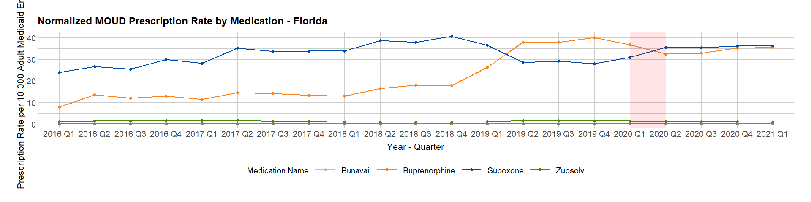
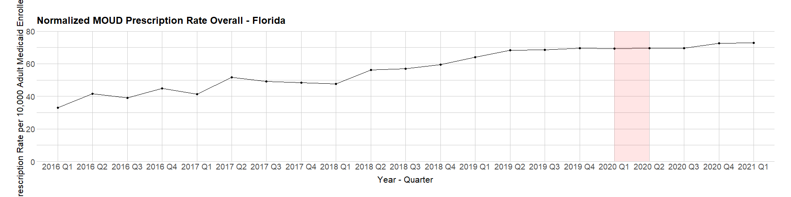
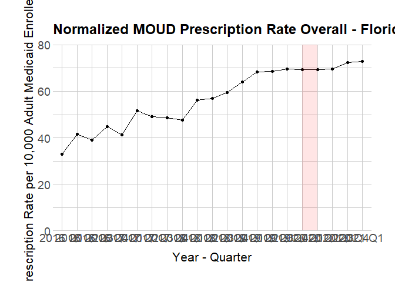
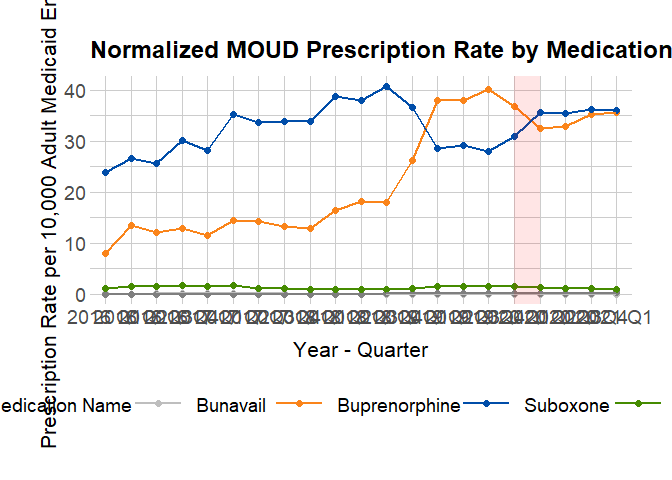

Table and Graph for 10k Rate
================
Michael Quinn Maguire, MS
2022-08-01

``` r
library(tidyverse)
```

    ## ── Attaching packages ─────────────────────────────────────── tidyverse 1.3.2 ──
    ## ✔ ggplot2 3.3.6     ✔ purrr   0.3.4
    ## ✔ tibble  3.1.7     ✔ dplyr   1.0.9
    ## ✔ tidyr   1.2.0     ✔ stringr 1.4.0
    ## ✔ readr   2.1.2     ✔ forcats 0.5.1
    ## ── Conflicts ────────────────────────────────────────── tidyverse_conflicts() ──
    ## ✖ dplyr::filter() masks stats::filter()
    ## ✖ dplyr::lag()    masks stats::lag()

``` r
library(tidylog)
```

    ## 
    ## Attaching package: 'tidylog'
    ## 
    ## The following objects are masked from 'package:dplyr':
    ## 
    ##     add_count, add_tally, anti_join, count, distinct, distinct_all,
    ##     distinct_at, distinct_if, filter, filter_all, filter_at, filter_if,
    ##     full_join, group_by, group_by_all, group_by_at, group_by_if,
    ##     inner_join, left_join, mutate, mutate_all, mutate_at, mutate_if,
    ##     relocate, rename, rename_all, rename_at, rename_if, rename_with,
    ##     right_join, sample_frac, sample_n, select, select_all, select_at,
    ##     select_if, semi_join, slice, slice_head, slice_max, slice_min,
    ##     slice_sample, slice_tail, summarise, summarise_all, summarise_at,
    ##     summarise_if, summarize, summarize_all, summarize_at, summarize_if,
    ##     tally, top_frac, top_n, transmute, transmute_all, transmute_at,
    ##     transmute_if, ungroup
    ## 
    ## The following objects are masked from 'package:tidyr':
    ## 
    ##     drop_na, fill, gather, pivot_longer, pivot_wider, replace_na,
    ##     spread, uncount
    ## 
    ## The following object is masked from 'package:stats':
    ## 
    ##     filter

-   Read in the file with the `RatePer100k` variable.

``` r
base_rate_file <- read_csv(file = './data/clean/20220218_fl-moud-aggregate.csv') |>
  mutate(yearQuarter = zoo::as.yearqtr(yearQuarter),
         ratePer10k = round(ratePer100k / 10, digits = 2))
```

    ## Rows: 105 Columns: 5
    ## ── Column specification ────────────────────────────────────────────────────────
    ## Delimiter: ","
    ## chr (2): yearQuarter, allDrugs
    ## dbl (3): totalRX, total, ratePer100k
    ## 
    ## ℹ Use `spec()` to retrieve the full column specification for this data.
    ## ℹ Specify the column types or set `show_col_types = FALSE` to quiet this message.
    ## mutate: converted 'yearQuarter' from character to double (0 new NA)
    ## 
    ##         new variable 'ratePer10k' (double) with 70 unique values and 0% NA

``` r
base_seq_file <- base_rate_file |>
  distinct(yearQuarter) |>
  mutate(seq = row_number())
```

    ## distinct: removed 84 rows (80%), 21 rows remaining
    ## mutate: new variable 'seq' (integer) with 21 unique values and 0% NA

``` r
xMinimum <- base_seq_file$seq[base_seq_file$yearQuarter == "2020 Q1"]
xMaximum <- base_seq_file$seq[base_seq_file$yearQuarter == "2020 Q2"]

read_csv(file = './data/clean/20220218_fl-quarterly-enrollment-denominator.csv')
```

    ## Rows: 24 Columns: 2
    ## ── Column specification ────────────────────────────────────────────────────────
    ## Delimiter: ","
    ## chr (1): yearQtr
    ## dbl (1): total
    ## 
    ## ℹ Use `spec()` to retrieve the full column specification for this data.
    ## ℹ Specify the column types or set `show_col_types = FALSE` to quiet this message.

    ## # A tibble: 24 × 2
    ##    yearQtr    total
    ##    <chr>      <dbl>
    ##  1 2016 Q1 1626231.
    ##  2 2016 Q2 1628634.
    ##  3 2016 Q3 1634728.
    ##  4 2016 Q4 1631855.
    ##  5 2017 Q1 1637312 
    ##  6 2017 Q2 1628608 
    ##  7 2017 Q3 1613870 
    ##  8 2017 Q4 1611012 
    ##  9 2018 Q1 1598327.
    ## 10 2018 Q2 1582947.
    ## # … with 14 more rows
    ## # ℹ Use `print(n = ...)` to see more rows

``` r
base_rate_file_buprenorphine <- base_rate_file |>
  group_by(yearQuarter) |>
  summarize(totalPrescriptions = sum(totalRX))
```

    ## group_by: one grouping variable (yearQuarter)
    ## summarize: now 21 rows and 2 columns, ungrouped

``` r
base_rate_denom <- base_rate_file |> 
  distinct(yearQuarter, total)
```

    ## distinct: removed 84 rows (80%), 21 rows remaining

``` r
base_rate_final <- base_rate_file_buprenorphine |>
  left_join(base_rate_denom, by = 'yearQuarter') |>
  mutate(prescriptionsByQuarter = round(((totalPrescriptions / total) * 10000), digits = 2)) |>
  rename(`Year Quarter` = yearQuarter, `Prescriptions per 10,000 Medicaid Enrollees` = prescriptionsByQuarter) |>
  select(`Year Quarter`, `Prescriptions per 10,000 Medicaid Enrollees`)
```

    ## left_join: added one column (total)
    ##            > rows only in x    0
    ##            > rows only in y  ( 0)
    ##            > matched rows     21
    ##            >                 ====
    ##            > rows total       21
    ## mutate: new variable 'prescriptionsByQuarter' (double) with 21 unique values and 0% NA
    ## rename: renamed 2 variables (Year Quarter, Prescriptions per 10,000 Medicaid Enrollees)
    ## select: dropped 2 variables (totalPrescriptions, total)

``` r
base_rate_drugs_final <- base_rate_file |>
  select(yearQuarter, allDrugs, ratePer10k) |>
  rename(`Year Quarter` = yearQuarter, Medication = allDrugs, `Prescriptions per 10,000 Medicaid Enrollees` = ratePer10k)
```

    ## select: dropped 3 variables (totalRX, total, ratePer100k)
    ## rename: renamed 3 variables (Year Quarter, Medication, Prescriptions per 10,000 Medicaid Enrollees)

``` r
write_csv(base_rate_drugs_final, file = paste0('./data/clean/', format(Sys.Date(), '%Y%m%d'), '_individual-drugs-per-10k-enrollees-by-year-and-quarter.csv'))

write_csv(base_rate_final, file = paste0('./data/clean/', format(Sys.Date(), '%Y%m%d'), '_prescriptions-per-10k-enrollees-by-year-and-quarter.csv'))
```

``` r
base_rate_plot_by_drug <- base_rate_file |>
  ggplot() +
  geom_point(aes(x = as.factor(yearQuarter), y = ratePer10k, group = allDrugs, color = allDrugs), size = 2) +
  geom_line(aes(x = as.factor(yearQuarter), y = ratePer10k, group = allDrugs, color = allDrugs), size = 1) +
  annotate('rect', xmin = xMinimum, xmax = xMaximum, ymin = -Inf, ymax = Inf, fill = 'red', alpha = 0.1) +
  scale_color_manual(values = c("Bunavail" = "grey", "Buprenorphine" = "#FA841A", "Suboxone" = "#004DA9", "Zubsolv" = "chartreuse4")) +
  xlab('Year - Quarter') +
  ylab('Prescription Rate per 10,000 Adult Medicaid Enrollees') +
  ggtitle("Normalized MOUD Prescription Rate by Medication - Florida") +
  hrbrthemes::theme_ipsum_rc() +
  theme(
    axis.text.x = element_text(size = 14),
    axis.text.y = element_text(size = 14),
    axis.title.x = element_text(size = 16, hjust = 0.5, vjust = -1),
    axis.title.y = element_text(size = 16, hjust = 0.5),
    legend.position = 'bottom',
    legend.text = element_text(size = 14),
    legend.title = element_text(size = 14),
    legend.key.size = unit(3, 'line')
  ) +
  labs(color = 'Medication Name')

base_rate_plot_by_drug
```

    ## Warning in grid.Call(C_stringMetric, as.graphicsAnnot(x$label)): font family not
    ## found in Windows font database

    ## Warning in grid.Call(C_stringMetric, as.graphicsAnnot(x$label)): font family not
    ## found in Windows font database

    ## Warning in grid.Call(C_textBounds, as.graphicsAnnot(x$label), x$x, x$y, : font
    ## family not found in Windows font database

    ## Warning in grid.Call(C_stringMetric, as.graphicsAnnot(x$label)): font family not
    ## found in Windows font database

    ## Warning in grid.Call(C_textBounds, as.graphicsAnnot(x$label), x$x, x$y, : font
    ## family not found in Windows font database

    ## Warning in grid.Call(C_textBounds, as.graphicsAnnot(x$label), x$x, x$y, : font
    ## family not found in Windows font database

    ## Warning in grid.Call(C_textBounds, as.graphicsAnnot(x$label), x$x, x$y, : font
    ## family not found in Windows font database

    ## Warning in grid.Call(C_textBounds, as.graphicsAnnot(x$label), x$x, x$y, : font
    ## family not found in Windows font database

    ## Warning in grid.Call(C_textBounds, as.graphicsAnnot(x$label), x$x, x$y, : font
    ## family not found in Windows font database

    ## Warning in grid.Call(C_textBounds, as.graphicsAnnot(x$label), x$x, x$y, : font
    ## family not found in Windows font database

    ## Warning in grid.Call(C_textBounds, as.graphicsAnnot(x$label), x$x, x$y, : font
    ## family not found in Windows font database

    ## Warning in grid.Call(C_textBounds, as.graphicsAnnot(x$label), x$x, x$y, : font
    ## family not found in Windows font database

    ## Warning in grid.Call(C_textBounds, as.graphicsAnnot(x$label), x$x, x$y, : font
    ## family not found in Windows font database

    ## Warning in grid.Call(C_textBounds, as.graphicsAnnot(x$label), x$x, x$y, : font
    ## family not found in Windows font database

    ## Warning in grid.Call.graphics(C_text, as.graphicsAnnot(x$label), x$x, x$y, :
    ## font family not found in Windows font database

    ## Warning in grid.Call(C_textBounds, as.graphicsAnnot(x$label), x$x, x$y, : font
    ## family not found in Windows font database

    ## Warning in grid.Call(C_textBounds, as.graphicsAnnot(x$label), x$x, x$y, : font
    ## family not found in Windows font database

<!-- -->

``` r
base_rate_plot <- base_rate_final |>
  ggplot(aes(x = as.factor(`Year Quarter`), y = `Prescriptions per 10,000 Medicaid Enrollees`)) +
  geom_point() +
  geom_line(aes(group = 1)) +
  annotate('rect', xmin = xMinimum, xmax = xMaximum, ymin = -Inf, ymax = Inf, fill = 'red', alpha = 0.1) +
  xlab('Year - Quarter') +
  ylab('Prescription Rate per 10,000 Adult Medicaid Enrollees') +
  ggtitle("Normalized MOUD Prescription Rate Overall - Florida") +
  hrbrthemes::theme_ipsum_rc() +
  theme(
    axis.text.x = element_text(size = 14),
    axis.text.y = element_text(size = 14),
    axis.title.x = element_text(size = 16, hjust = 0.5, vjust = -1),
    axis.title.y = element_text(size = 16, hjust = 0.5),
    legend.position = 'bottom',
    legend.text = element_text(size = 14),
    legend.title = element_text(size = 14),
    legend.key.size = unit(3, 'line')
  ) +
  labs(color = 'Medication') +
  scale_y_continuous(expand = c(0, 0), limits = c(0, 80))

base_rate_plot
```

    ## Warning in grid.Call(C_textBounds, as.graphicsAnnot(x$label), x$x, x$y, : font
    ## family not found in Windows font database

    ## Warning in grid.Call(C_textBounds, as.graphicsAnnot(x$label), x$x, x$y, : font
    ## family not found in Windows font database

    ## Warning in grid.Call(C_textBounds, as.graphicsAnnot(x$label), x$x, x$y, : font
    ## family not found in Windows font database

    ## Warning in grid.Call(C_textBounds, as.graphicsAnnot(x$label), x$x, x$y, : font
    ## family not found in Windows font database

    ## Warning in grid.Call(C_textBounds, as.graphicsAnnot(x$label), x$x, x$y, : font
    ## family not found in Windows font database

    ## Warning in grid.Call(C_textBounds, as.graphicsAnnot(x$label), x$x, x$y, : font
    ## family not found in Windows font database

    ## Warning in grid.Call(C_textBounds, as.graphicsAnnot(x$label), x$x, x$y, : font
    ## family not found in Windows font database

    ## Warning in grid.Call(C_textBounds, as.graphicsAnnot(x$label), x$x, x$y, : font
    ## family not found in Windows font database

    ## Warning in grid.Call(C_textBounds, as.graphicsAnnot(x$label), x$x, x$y, : font
    ## family not found in Windows font database

    ## Warning in grid.Call(C_textBounds, as.graphicsAnnot(x$label), x$x, x$y, : font
    ## family not found in Windows font database

    ## Warning in grid.Call.graphics(C_text, as.graphicsAnnot(x$label), x$x, x$y, :
    ## font family not found in Windows font database

    ## Warning in grid.Call(C_textBounds, as.graphicsAnnot(x$label), x$x, x$y, : font
    ## family not found in Windows font database

<!-- -->

``` r
Cairo::CairoPDF(file = paste0('./plots/', format(Sys.Date(), '%Y%m%d'), '_plots-for-grant-updates.pdf'), onefile = TRUE, width = 18, height = 9)
base_rate_plot
```

<!-- -->

``` r
base_rate_plot_by_drug
```

<!-- -->

``` r
dev.off()
```

    ## png 
    ##   2
